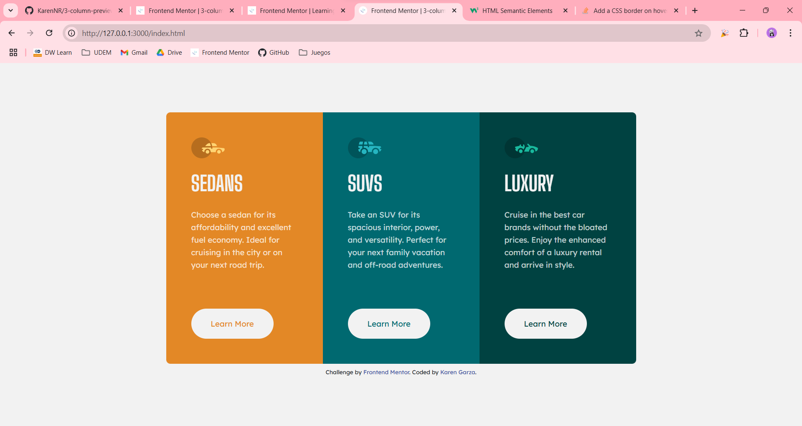

# Frontend Mentor - 3-column preview card component solution

This is a solution to the [3-column preview card component challenge on Frontend Mentor](https://www.frontendmentor.io/challenges/3column-preview-card-component-pH92eAR2-). Frontend Mentor challenges help you improve your coding skills by building realistic projects. 

## Table of contents

- [Overview](#overview)
  - [The challenge](#the-challenge)
  - [Screenshot](#screenshot)
  - [Links](#links)
- [My process](#my-process)
  - [Built with](#built-with)
  - [What I learned](#what-i-learned)
  - [Useful resources](#useful-resources)
- [Author](#author)

## Overview

### The challenge

Users should be able to:

- View the optimal layout depending on their device's screen size
- See hover states for interactive elements

### Screenshot



### Links

- [Live Site URL](https://3-column-preview-card-component-nine-mocha.vercel.app/)

## My process

### Built with

- Semantic HTML5 markup
- CSS
- [Bootstrap](https://getbootstrap.com/) - for styles and layout

### What I learned

For this challenge I tried using semantic HTML5 markup, which means using tags that clearly define the content of the website. This tags include:
```html
<article>
<aside>
<details>
<figcaption>
<figure>
<footer>
<header>
<main>
<mark>
<nav>
<section>
<summary>
<time>
```

For this challenge, this is the structure I used.
```html
<main class="container">
    <section class="row">
        <article class="col-12 col-md-4 p-5">
            ...
        </article>
        <article>
            ...
        </article>
        <article class="col-12 col-md-4 p-5">
            ...
        </article>
    </section>
    <section class="attribution pt-2">
      ...
    </section>
</main>
```

### Useful resources

- [HTML Semantic Elements](https://www.w3schools.com/html/html5_semantic_elements.asp) - this is a useful guide to understand how to organize the content with semantic tags.

## Author

- Frontend Mentor - [@KarenNR](https://www.frontendmentor.io/profile/KarenNR)